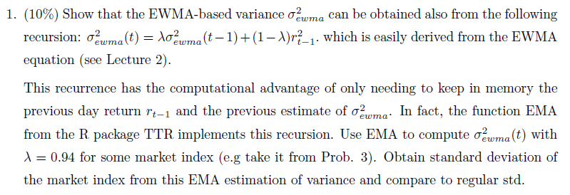
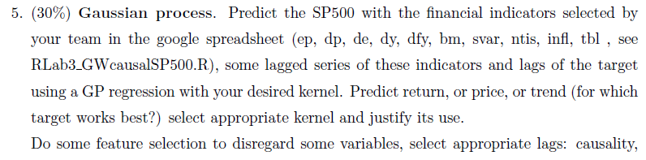

```{r setup, include=FALSE}
knitr::opts_chunk$set(echo = TRUE)
knitr::opts_knit$set(root.dir = 'C:\\Users\\ivano\\Desktop\\DSMMaster\\MLFin\\')
rm(list=ls())

library(tidyverse)
library(xts)
library(quantmod)
library(TTR)
library(lmtest)
library(dygraphs)
library(kernlab)
library(ggplot2)
library(glmnet)
library(roll)
library(MASS)
library(kableExtra)

set.seed(666)
```

```{r, }
# Auxiliary functions
# sum of squares
ssr <-function(actual,pred){
  sum((actual - pred)^2)
}

##Normalize Residual Mean Square Error (NRMSE) funct
nrmse <- function(actual,pred){
  sqrt(ssr(actual,pred)/((length(actual)-1)*var(actual)))
} 

##percentage of outperforming direct sample mean (sample expected value)
pcorrect<- function(actual,pred){
  (1-nrmse(actual,pred))*100
}
```

# Exercise 1 - EMA and SD



We read the time series data, extract the index names and codes and separate the market indexes from the volatility indexes.

```{r}
data.env = readRDS('.\\HW1\\WorldMarkts99_20.RDS')

names<-c("India", "Brazil","UK","Germany","USA","China-Shanghai",
             "Spain","Indonesia","Mexico","Japan","Taiwan","VLIC","VIX")

markets_codes = ls(data.env)[1:11]
markets_names = names[1:11]
volatilities_codes = ls(data.env)[12:13]
volatilities_names = names[12:13]

markets = data.frame(matrix(ncol=2, nrow=11))
colnames(markets) = c('name', 'code')
markets$name = markets_names
markets$code = markets_codes

```

Next we choose the Mexico index (MXX) to compute the Exponential Moving Average for the the index time series with the indicated labmda and compare to moving standard deviation. 

```{r warning=FALSE}
start_date = '2017-07-01'
end_date = '2019-06-30'

mex_market = xts()
mex_market = xts()
mex_market_idx = na.approx(Ad(get('MXX', data.env)))
mex_market_idx = window(mex_market_idx, start=start_date, end=end_date)
mex_market = periodReturn(mex_market_idx,period='daily', type='log')

 

lambda = 0.50
ratio = lambda
n = 1
mex_ema = sqrt(EMA(mex_market^2, n=n, ratio=ratio))
mex_sd = roll_sd(mex_market, width=30)

colnames(mex_sd) = c('SD')

merged = merge(mex_ema, mex_sd, all=FALSE)

mex_idx_plot = dygraph(data=mex_market_idx, main='MXX index') %>%
  dyRangeSelector() %>%
  dyAxis('x', label = "Date") %>%
  dyAxis('y', axisLabelFormatter='function(v){return (v).toFixed(4)}') %>%
  dyOptions(axisLabelFontSize=10, fillGraph = FALSE, fillAlpha=0.5, drawPoints=FALSE)
  
mex_idx_plot

```

We merge together the extracted Exponential Moving Average (of the squared returns) and the rolling standard deviation with a 30-day window to make them comparable.

The data shows that when EMA oscillates the standard deviation increases and it follows this pattern closely, however the standard deviation takes longer to respond to changes. 

```{r}
mex_ema_plot = dygraph(data=merged, main='EMA vs SD') %>%
  dyRangeSelector() %>%
  dyAxis('x', label = "Date") %>%
  dyAxis('y', axisLabelFormatter='function(v){return (v).toFixed(4)}') %>%
  dyOptions(axisLabelFontSize=10, fillGraph = FALSE, fillAlpha=0.5, drawPoints=FALSE)
  
mex_ema_plot
```

# Exercise 3 - Causality


To complete this task we will be taking the following actions:

1. extract data for at daily level for  each of the 11 indexes into a time series and input an interpolated value (using na.approx function) where NAs exists in the data. As documentation indicates and this means that NA values in the time series are replaced by linear interpolation. 
2. convert the indexes time series to weekly and monthly periods
3. filter the data to contain only the windows assigned to the team (2017-07-01 - 2019-06-30)
4. Calculate the exponential moving average for all indexes and periods

The data for all indexes is stored in a list of dataframes, so we will end up with four type of dataframes combining the market indexes and volatility indexes (from EMA) with the weekly and monthly periods for each. 


```{r, warning=FALSE}
return_week = list()
return_month = list()
volat_week = list()
volat_month = list()
periods = c('weekly','monthly')

start_date="2017-07-01"
end_date="2019-06-30"

for (period in periods) {
  for (row in 1:nrow(markets)) {
    temp = xts()
    temp = na.approx(Ad(get(markets[row,'code'], data.env)))
    temp = periodReturn(temp, period=period, type='log')
    temp = window(temp, start=start_date, end=end_date)
    ema = EMA(temp^2, n=n, ratio=ratio)
    
    if (period == 'weekly') {
      return_week[[markets[row,'name']]] = temp
      volat_week[[markets[row,'name']]] = ema
    } else {
      return_month[[markets[row,'name']]] = temp
      volat_month[[markets[row,'name']]] = ema
    }
  }
}
```

We can now run the causality test on all the different index combinations and produce the tables indicated in the exercise. 

```{r, warning=FALSE}
gtest = function(market1, market2, minorder, maxorder){
  test_result = ""
  for (i in minorder:maxorder) {
    caus = grangertest(market1, market2, order=i)
    if (caus$`Pr(>F)`[2]<0.05) {
      test_result = paste0(test_result,"1")
    }
    else{
      test_result = paste0(test_result,"0")
    }
  }
  return(test_result)
}

res_return_week = data.frame(matrix(nrow=11, ncol=11))
colnames(res_return_week) = names(return_week)
rownames(res_return_week) = names(return_week)

res_return_month = data.frame(matrix(nrow=11, ncol=11))
colnames(res_return_month) = names(return_month)
rownames(res_return_month) = names(return_month)

res_volat_week = data.frame(matrix(nrow=11, ncol=11))
colnames(res_volat_week) = names(return_week)
rownames(res_volat_week) = names(return_week)

res_volat_month = data.frame(matrix(nrow=11, ncol=11))
colnames(res_volat_month) = names(return_month)
rownames(res_volat_month) = names(return_month)

for (first_market in names(return_week)){
  for (second_market in names(return_week)){
    if (first_market!=second_market){

      row = nrow(res_return_week)+1

      caus_week = gtest(return_week[[first_market]], return_week[[second_market]],1,4)
      res_return_week[first_market,second_market] = caus_week
      
      caus_month = gtest(return_month[[first_market]], return_month[[second_market]],1,4)
      res_return_month[first_market,second_market] = caus_month
      
      caus_week = gtest(volat_week[[first_market]], volat_week[[second_market]],1,4)
      res_volat_week[first_market,second_market] = caus_week
      
      caus_month = gtest(volat_month[[first_market]], volat_month[[second_market]],1,4)
      res_volat_month[first_market,second_market] = caus_month
      
      }
    }
}
```

### Weekly returns

```{r}
res_return_week %>% 
  kbl() %>%
  kable_classic(full_width = F, html_font = "Cambria")
```
### Monthly returns

```{r}
res_return_month %>% 
  kbl() %>%
  kable_classic(full_width = F, html_font = "Cambria")
```

### Weekly volatility

```{r}
res_volat_week %>% 
  kbl() %>%
  kable_classic(full_width = F, html_font = "Cambria")
```

### Monthly volatility

```{r}
res_volat_month %>% 
  kbl() %>%
  kable_classic(full_width = F, html_font = "Cambria")
```
## Conclusions

We can pick a couple of examples from the causality results on returns and volatility using granger test.

For example on the weekly returns data it is found that Mexico's index data is statistically significant to be useful to predict USA index with all lags. This might seem like a surprising finding but that could be probably explained by the fact that Mexico's index is following closely the USA one and might be replicating its behavior. However at monthly level that effect is lost, so the predicting power is very limited.


While talking about volatility Brazil weekly volatility with lags 3 and 4 helps explaining Mexico volatility as shown by the granger test results.

In general very few instances on this time period detect a significant causality for both returns and volatility

# Exercise 4 - Kernels



```{r}

# generate covariance matrix for points in `x` using given kernel function
cov_matrix <- function(x, kernel_fn, ...) {
    outer(x, x, function(a, b) kernel_fn(a, b, ...))
}

# given x coordinates, take N draws from kernel function at those points
draw_samples <- function(x, N, seed = 1, kernel_fn, ...) {
    Y <- matrix(NA, nrow = length(x), ncol = N)
    set.seed(seed)
    for (n in 1:N) {
        K <- cov_matrix(x, kernel_fn, ...)
        Y[, n] <- mvrnorm(1, mu = rep(0, times = length(x)), Sigma = K)
    }
    Y
}

x = seq(0, 2, length.out = 201)
N = 5
col_list = c("red", "blue", "black", "green", "yellow") 

# set parameters
lambda_se = c(0.1, 1, 10)
sigma_se = 1

lambda_rq = c(0.1, 1, 10)
sigma_rq = 1
alpha_rq = c(0.1, 0.5, 50)

```

We will plot below the SE kernel with variations on the lambda parameter (length) and then the RQ kernel, first increasing the lambda parameter and afterwards with variation on the alpha parameter, that way we will be able to detect the effect of each of those parameter on each kernel.

### Squared Exponential kernel
#### Length variation

```{r fig.width=10,fig.height=3}
se_kernel = function(x, y, sigma = sigma_se, length = 1) {
    sigma^2 * exp(- (x - y)^2 / (2 * length^2))
}
par(mfrow = c(1, 3))
for (l in lambda_se) {
    Y = draw_samples(x, N, kernel_fn = se_kernel, length = l)
    
    plot(range(x), range(Y), xlab = "x", ylab = "y", type = "n",
         main = paste("SE kernel, length =", l))
    for (n in 1:N) {
        lines(x, Y[, n], col = col_list[n], lwd = 1.5)
    }
}
```

### Rational Quadratic kernel
#### Length variation

```{r fig.width=10,fig.height=3}
rq_kernel = function(x, y, alpha = 1, sigma = 1, length = 1) {
    sigma^2 * (1 + (x - y)^2 / (2 * alpha * length^2))^(-alpha)
}
par(mfrow = c(1, 3))
  for (l in lambda_rq) {
    Y = draw_samples(x, N, kernel_fn = rq_kernel, length = l, alpha = 0.1)
    
    plot(range(x), range(Y), xlab = "x", ylab = "y", type = "n",
         main = paste("RQ kernel, length=", l, " alpha=",0.1))
    for (n in 1:N) {
        lines(x, Y[, n], col = col_list[n], lwd = 1.5)
    }
  }
```

#### Alpha variation

```{r fig.width=10,fig.height=3}
par(mfrow = c(1, 3))
  for (a in alpha_rq) {
    Y = draw_samples(x, N, kernel_fn = rq_kernel, length = 0.1, alpha = a)
    
    plot(range(x), range(Y), xlab = "x", ylab = "y", type = "n",
         main = paste("RQ kernel, length=", 0.1, " alpha=",a))
    for (n in 1:N) {
        lines(x, Y[, n], col = col_list[n], lwd = 1.5)
    }
  }
```

### Conclusions

In both kernels SE an RQ, as we increase the parameter lambda (length) the functions plotted become significantly flatter and lose variance altogether. For the alpha parameter in the RQ kernel case, increasing the alpha parameter causes the fucntion to be smoother and only reduces variance locally but doesn't fully flatten the plot. 

# Exercise 5 - Gaussian Process


## Reading data

First we read the data from the provided csv file and analyze the columns that it contains

```{r}
sp500goyal = as.xts(read.zoo('.\\data\\GoyalMonthly2005.csv', sep=',', header=TRUE, format='%Y-%m-%d'))
data=sp500goyal['1927/2005']
colnames(data)
```
## Feature creation

Next we calculate the variables indicated for the team (ep, dp and dy) and calculate the lags for each of them, including the lags for the main index and we merge them all in the the time series dataframe. 

Given that we are calculating lags we also trim out NAs generated on by those lags calculations.


```{r}
tau = 1 

target = data$Index
target = diff(log(data$Index), diff=tau)
target = na.trim(target-mean(na.omit(target)))

sp500ep = log(data$E12) - log(stats::lag(data$Index,1)) # ep
sp500ep = diff(sp500ep, diff=tau)

sp500dp = log(data$D12) - log(stats::lag(data$Index,1)) # dp
sp500dp = diff(sp500dp, diff=tau)

sp500dy = log(data$D12) - log(stats::lag(data$Index,1)) # dy
sp500dy = diff(sp500dy, diff=tau)

feat = merge(na.trim(stats::lag(target,1)),
             na.trim(stats::lag(target,2)),
             na.trim(stats::lag(target,3)),
             sp500ep,
             na.trim(stats::lag(sp500ep,1)),
             na.trim(stats::lag(sp500ep,2)),
             sp500dp,
             na.trim(stats::lag(sp500dp,1)),
             na.trim(stats::lag(sp500dp,2)),
             sp500dy,
             na.trim(stats::lag(sp500dy,1)),
             na.trim(stats::lag(sp500dy,2)),
             #add other features here,
             all=FALSE)

dataset = merge(feat,target,all=FALSE)

colnames(dataset) = c("lag.1", "lag.2", "lag.3",
                      "ep","ep.1","ep.2",
                      "dp","dp.1","dp.2",
                      "dy","dy.1","dy.2",
                      #names of other features,
                      "TARGET")

```
## Train/Test splitting

We split the data in training and testing datasets using a 75/25% proportion

```{r}
##Divide data into training (75%) and testing (25%). 
T<-nrow(dataset)
p=0.75
T_trn <- round(p*T)
trainindex <- 1:T_trn

train_data = as.data.frame(dataset[trainindex,])
rownames(train_data) = NULL
test_data = as.data.frame(dataset[-trainindex,])
rownames(test_data) = NULL
```

## Run gaussian process (all features)

### Run model

And we execute our gaussian process utilizing the Radial Basis Function kernel (rbfdot). We used the RBF because the kernel is very effective in predicting interpolations and short distance extrapolations, which are good for our exercise where we predict 1 period ahead. 

```{r}
gpfit = gausspr(TARGET~., data=train_data,
                type="regression",
                kernel="rbfdot",
                kpar = list(sigma = 0.1), 
                var = 0.003
)
gpfit

GPpredict <- predict(gpfit,test_data)

```
### Evaluate results

```{r}
### Evaluation of Results
actualTS = test_data[,ncol(test_data)] 
predicTS = GPpredict

res <- list("GP"=pcorrect(actualTS,predicTS))
#unlist(res)
print(paste0('NRMSE: ',unlist(res)))

train.error <- error(gpfit)  
test.error <- mean((actualTS - predicTS)^2)
gap <- test.error - train.error ; 
#gap
print(paste0('MSE diff (test-train): ', gap))
```
### Plot results

```{r}
yl=c(min(actualTS,predicTS),max(actualTS,predicTS)) 
plot(actualTS,predicTS,ylim=yl)
```

```{r}
plot(actualTS,t='l',col='gray20', ylab='', xlab ='',lty=3, main='GP predictions', cex.main=0.75)
lines(GPpredict,col='green',lwd=2)
legend('bottomright',legend = c('target','GP'),col=c('gray20','green'),lty=c(3,1),cex=.7)
```

### Conclusions

The results show that our NRMSE is still a bit low and in the graph we can appreciate that the predicted values have an excessive variance in some cases that exaggerate the predicted value.  

## Variable selection with Lasso

In order to improve our gaussian process model that utilized all features, we will do some variable selection using lasso. We initially set our features and target to run them through our lasso model, where we will select our optimal lambda.

### Select lambda

```{r}
x_vars = model.matrix(TARGET~. , dataset)[,-1]
y_var = dataset$TARGET

cv_output = cv.glmnet(x_vars, 
                      y_var,
                      alpha = 1, 
                      nfolds = 100 )


best_lam <- cv_output$lambda.min
best_lam
```

We can plot the lambdas explored and how the minimal version got selected from the lasso cross-validation.

```{r}
plot(cv_output)
```

### Selected variables

And finally we can have a look at the variables selected by Lasso using our best lambda

```{r}
lasso_best <- glmnet(x_vars, y_var, alpha = 1, lambda = best_lam)

coef(lasso_best)
```

### Run model

If we refit our model only using the features suggested by lasso and output the results so we can see if our prediction improves.


```{r}
gpfit = gausspr(TARGET~., data=dplyr::select(train_data,lag.1,dp.2,TARGET),
                type="regression",
                kernel="rbfdot", 
                kpar = list(sigma = 0.1), 
                var = 0.003
)
gpfit


GPpredict <- predict(gpfit, dplyr::select(test_data,lag.1,dp.2,TARGET))
```

### Evaluate results

```{r}
### Evaluation of Results
actualTS = test_data[,ncol(test_data)]
predicTS = GPpredict

res <- list("GP"=pcorrect(actualTS,predicTS))
#unlist(res)
print(paste0('NRMSE: ',unlist(res)))

train.error <- error(gpfit)  
test.error <- mean((actualTS - predicTS)^2)
gap <- test.error - train.error ; 
#gap
print(paste0('MSE diff (test-train): ', gap))
```

### Plot results

```{r}
yl=c(min(actualTS,predicTS),max(actualTS,predicTS))
plot(actualTS,predicTS,ylim=yl)
```

```{r}
plot(actualTS,t='l',col='gray20', ylab='', xlab ='',lty=3, main='GP predictions', cex.main=0.75)
lines(GPpredict,col='green',lwd=2)
legend('bottomright',legend = c('target','GP'),col=c('gray20','green'),lty=c(3,1),cex=.7)
```

### Conclusions

We can see that using only the significant features according to lasso reduces the variance of the prediction and show a notable reduction on the MSE, which means that lasso effectively helps on producing a more accurate prediction on returns in general terms, but it also makes the model extremely conservative and has very little variance on returns, hence the almost flat line around zero when comparing actual vs predicted target.
